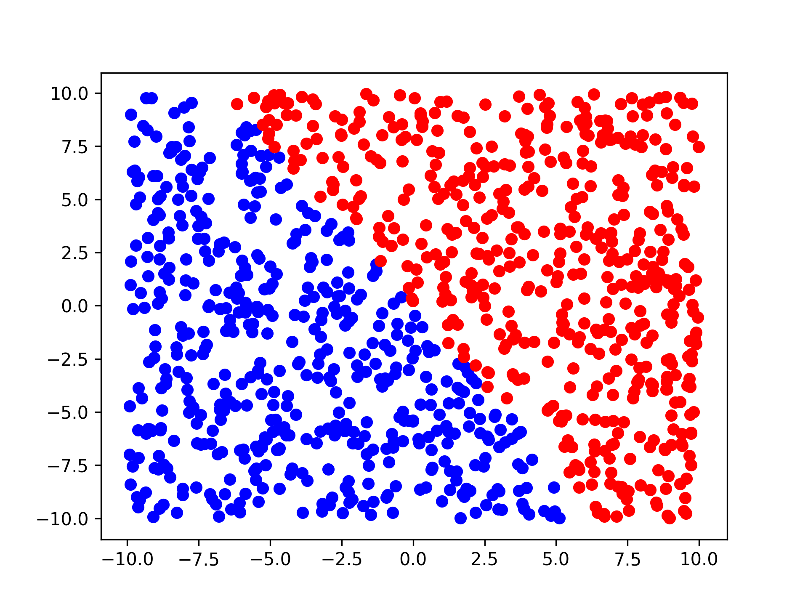
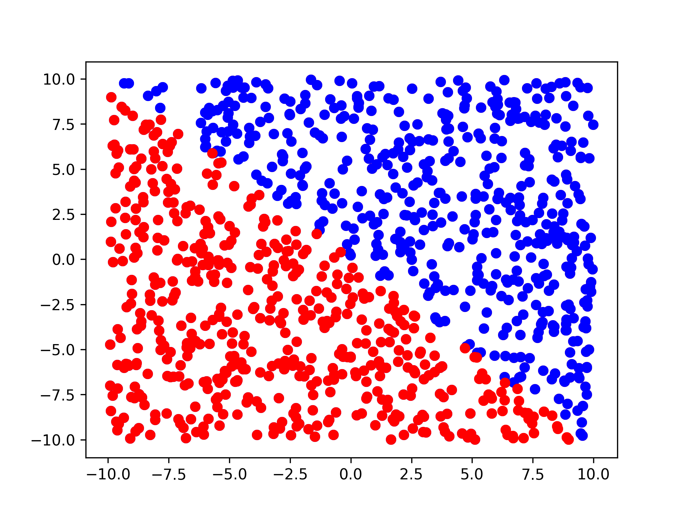

# Deep learning & application - Practice #1 

Author: 김영진 2016025241

## Time comparison

- element-wise version: 5.78 secs
- vectorized version: 0.36 secs

## Estimated unknown function parameters W & b

- W: [666.88, 666.67]
- b: 0.18

## Empirically determined (best) hyper parameter, alpha

*  alpha: 0.01

m=100,n=100,k=20 을 기준으로 실험했을 때, 대부분 20 iterations 만으로 99에 가까운 accuracy를 보였으며 0.1, 0.01, 0.001, ... 의 값들을 시험해본 결과 0.01보다 큰 값이기만 하면 대체로 비슷한 결과를 보였고, 심지어 10, 100, 1000 등의 값에서도 잘 작동하였다.

이 문제 에서의 정답 파라미터는 W[0] == W[1], b == 0 인 것을 쉽게 알 수 있고,  alpha (learning rate) 값이 적당히 크기만 하면 적절한 상태에 도달했다

## Accuracy

|                                  | m=10,n=100,K=2000 | m=100,n=100,K=2000 | m=1000,n=100,K=2000 |
| -------------------------------- | ----------------- | ------------------ | ------------------- |
| Accuracy (with 'm' train set)    | 100               | 100                | 100                 |
| Accuracy (with 'n' test samples) | 92                | 99                 | 100                 |

|                                  | m=1000,n=100,K=20 | m=1000,n=100,K=200 | m=1000,n=100,K=2000 |
| -------------------------------- | ----------------- | ------------------ | ------------------- |
| Accuracy (with 'm' train set)    | 98                | 100                | 100                 |
| Accuracy (with 'n' test samples) | 98                | 100                | 100                 |

## Discussion

Cross entropy loss 에서 사용되는 log함수로 인해서, 마지막 output값이 0초과 1미만인 상태를 항상 유지해주어야 하는데, sigmoid 함수에서 부동소수점 표현력의 한계로 인하여 0이나 1값이 나올 수 있다는 것을 확인하였다. 이를 해결하기 위해, 기존의
$$
\sigma(x) = \frac{1}{1+e^{-x}}
$$
로 정의된 sigmoid 함수를
$$
\sigma(x) = 0.01 + \frac{0.98}{1+e^{-x}}
$$
로 바꾸어 사용해서 y=0, y=1 선으로 부터 각각 0.01씩 멀어지도록 하였다.

Loss와 W의 변화를 살펴보면, Loss는 빠르게 수렴한 뒤에 거의 변화가 없지만, W의 경우 특정 방향으로 끝 없이 발산하는 것으로 보인다. K가 늘어날 수록 최종 결과의 W의 값이 계속 늘어나는 것을 확인할 수 있으며, 너무 많이 학습할 경우 overflow가 발생하여 오히려 문제가 될 것으로 추측된다.

이 모델이 구분하는 영역은 명백히, 선으로 구분되는 영역인 것으로 보이며, 학습 전후로 이 선의 방향과 위치가 변화하는 것으로 보인다.

### before

### after

